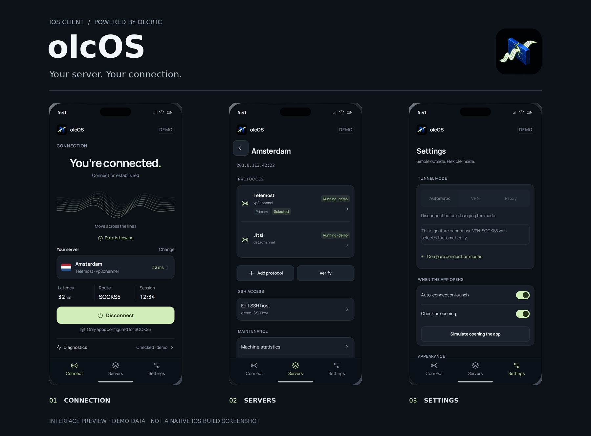
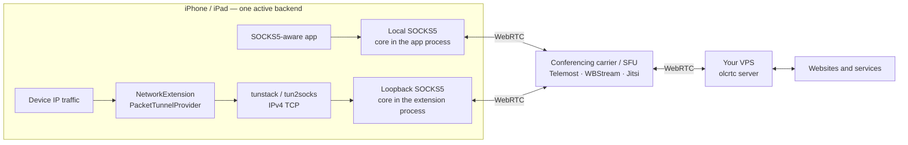
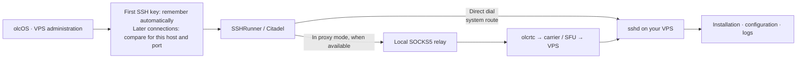

<div align="center">
  <p><a href="README.ru.md">Русский</a> · <strong>English</strong></p>
  
  <h1>olcOS</h1>
  <p><strong>Your iPhone. Your server. Your connection.</strong></p>
  <p>iOS 17+ · SwiftUI · Russian / English / French</p>
  <p><strong>1.0</strong> · build <strong>1</strong> · release tag <code>v1.0.1</code></p>
  <p>
    <a href="#quick-start">Get started</a> ·
    <a href="docs/build.md">Build</a> ·
    <a href="docs/architecture.md">Architecture</a> ·
    <a href="SECURITY.md">Security</a>
  </p>
</div>

**olcOS is an iOS client for connecting through your own VPS, powered by [olcrtc](https://github.com/openlibrecommunity/olcrtc), a core that carries traffic over WebRTC and video-conferencing infrastructure.** If you are looking for olcrtc on iPhone or exploring WebRTC-based censorship circumvention, this repository provides the app, build instructions and clear limits on what it can do.

<div align="center">
  
  <p><sub>UI concept preview — an interface illustration, not a native screenshot or evidence of a successful Xcode run.</sub></p>
</div>

> **Support scope:** iPhone and iPad with iOS/iPadOS 17+; VPN availability depends on the installed signature, NetworkExtension entitlements and iOS permission, not merely the type of Apple ID. [Project configuration](project.yml) · [VPN capability checks](App/Core/VPNController.swift).
>
> Android, Windows and macOS clients are plans, not released or supported olcOS products. Operation on every network, invisibility to network operators and resistance to all blocking are not guaranteed.

## Features

| Capability | What it means |
|---|---|
| **Automatic / VPN / SOCKS5** | Automatic tries VPN first and permits SOCKS5 fallback only when VPN permission or capability is confirmed unavailable; network, key and carrier errors do not authorize that switch. [Mode logic](App/Core/TunnelManager.swift). |
| **Your own VPS** | Install and manage a server over SSH, import connections using a URI or QR code, and subscribe to server lists. [Administration](App/Core/SSHRunner.swift) · [link formats](docs/uri.md). |
| **WebRTC carriers** | The code includes Telemost, WBStream and Jitsi; an option in the interface is not evidence that it works on your network today. [Configuration matrix](App/Utilities/CarrierTransportMatrix.swift). |
| **Inspectable connection state** | Connection, IP and speed checks plus logs help investigate failures; one successful probe does not guarantee that every app works. [Diagnostics](docs/diagnostic-messages.md). |
| **A quiet interface** | Russian, English and French; haptic feedback for actions; a decorative waveform that moves only while connected, visible and active, respecting Reduce Motion. It is **not a traffic graph or speed measurement**. [Localization](App/Localization/L10n.swift) · [waveform and haptics](App/Views/SignalWaveform.swift). |

## How traffic flows

SOCKS5 and VPN run the core in two different places; they are not two tunnels chained together. [TunnelEngine](App/Core/TunnelEngine.swift) · [PacketTunnelProvider](Tunnel/PacketTunnelProvider.swift).



SSH is a separate administration channel, not a required intermediate hop for user traffic: it connects directly or through an available local SOCKS5 relay; with an active VPN, an ordinary SSH dial follows system routing. **SSH can fall back to a direct connection**, but the saved server key is checked on both paths. [SSHRunner](App/Core/SSHRunner.swift) · [SSHTransport](App/Core/SSHTransport.swift).



Read more about the [architecture and trust boundaries](docs/architecture.md).

## Quick start

1. **Install a trusted build.** Check the contents and notes in [Releases](https://github.com/Hotelk52339/olcos-ios/releases); if the required artifact is absent, [build from source](docs/build.md). A tag alone is not evidence of successful compilation or testing.
2. **Add a connection.** Import a trusted `olcrtc://` link, QR code or `olcrtc-sub://` subscription, or prepare your own Linux VPS and install the server from the app. Connection links contain secrets — do not publish them. [Setup](docs/setup.md) · [URI formats](docs/uri.md).
3. **Connect to your VPS over SSH.** No manual fingerprint entry is needed: olcOS automatically remembers the first key for the server's host and port, then compares it on later connections. This is trust on first use (TOFU), not independent verification of the first server; the initial connection must be trusted. [Host-key checks](App/Core/SSHHostKeyVerification.swift).
4. **Choose a mode and connect.** Start with Automatic, then check the actual mode shown in the interface. SOCKS5 carries traffic only for explicitly configured clients, not the whole device. [Modes](App/Models/TunnelMode.swift) · [setup](docs/setup.md).

### Build on a Mac

You need full Xcode with an appropriate iOS SDK, XcodeGen, GitHub CLI and the Go version required by the pinned upstream project; the Xcode project and framework are generated, while the technical `olcrtc-ios` names remain unchanged. [Project](project.yml) · [build script](scripts/build-framework.sh).

```bash
gh repo clone Hotelk52339/olcos-ios -- --recurse-submodules
cd olcos-ios
./scripts/build-framework.sh
xcodegen generate --spec project.yml
open olcrtc-ios.xcodeproj
```

Select a signing team for the app and extension, keeping their bundle identifiers and entitlements consistent; **an unsigned build does not verify VPN operation on a device**. For test commands, downloading a prebuilt framework and packaging an IPA, see the [build guide](docs/build.md).

## Important limitations

- **VPN does not mean support for every kind of IP traffic.** The current packet path carries IPv4 TCP; UDP DNS receives a truncated response to encourage retry over TCP, while other UDP is dropped. IPv6 is captured by the route and dropped, not sent directly. Apps that require UDP or IPv6 may not work. [Provider](Tunnel/PacketTunnelProvider.swift) · [tunstack](gomobile/tunstack/tunstack.go).
- **VPN does not support `videochannel`.** System DNS must also be an IPv4 address on port 53; an invalid configuration is rejected before routes are installed. [Validation](Tunnel/PacketTunnelProvider.swift) · [VPNConfig](App/Models/VPNConfig.swift).
- **Fail-closed describes individual checks, not a universal kill switch.** Changes to a saved SSH key are rejected and unsupported packets are not sent directly from inside the active tunnel; this does not guarantee the absence of direct traffic before startup, after shutdown or during a VPN failure. [Security boundaries](SECURITY.md).
- **Secrets need careful handling.** Keys use Keychain for persistent storage, but VPN passes the room key and token through the system profile during startup and the session, then attempts to clear them after stopping; a failed save can leave them in the profile. [VPNController](App/Core/VPNController.swift).
- **Availability depends on the network and third-party carrier.** There are no promises of speed, service levels, anonymity or universal censorship circumvention. Use the app in accordance with applicable law and the rules of the services involved.

## Troubleshooting

| Symptom | First step |
|---|---|
| Automatic selected SOCKS5 | Read why VPN was unavailable; check the signature, NetworkExtension entitlement and iOS permission. Do not treat a proxy-only connection as whole-device protection. [Mode logic](App/Core/TunnelManager.swift). |
| VPN is connected, but some apps do not work | Check IPv4 TCP, system DNS, carrier/transport and the UDP/IPv6 limitations. [Setup](docs/setup.md). |
| SSH server key changed | The connection is blocked with a warning. If the server or key change is expected, explicitly confirm resetting saved trust and reconnect; the key is never silently replaced. [Security](SECURITY.md). |
| SOCKS5 port is busy | Free the selected port or update both it and the external client's settings; the app does not silently choose another port. [OLC-1026](docs/diagnostic-messages.md). |
| `Mobile.xcframework` is missing or script parity fails | Initialize the submodule and follow the instructions without disabling the check. [Build](docs/build.md). |

For an ordinary bug, [open a diagnostic report](https://github.com/Hotelk52339/olcos-ios/issues/new/choose). For a vulnerability, **use [private reporting only](SECURITY.md)**. Public reports do not require real IP addresses, keys, passwords, tokens, private room IDs or complete links.

## Contributing and licenses

[Contributing](CONTRIBUTING.md) covers changes and verification; the [technical contract](AGENTS.md) summarizes development constraints; the [documentation index](docs/README.md) lists the detailed guides.

olcOS is distributed under [MIT](LICENSE), Copyright (c) 2026 Hotelk52339. The olcrtc core is separately licensed under [WTFPL](olcrtc-upstream/LICENSE).
