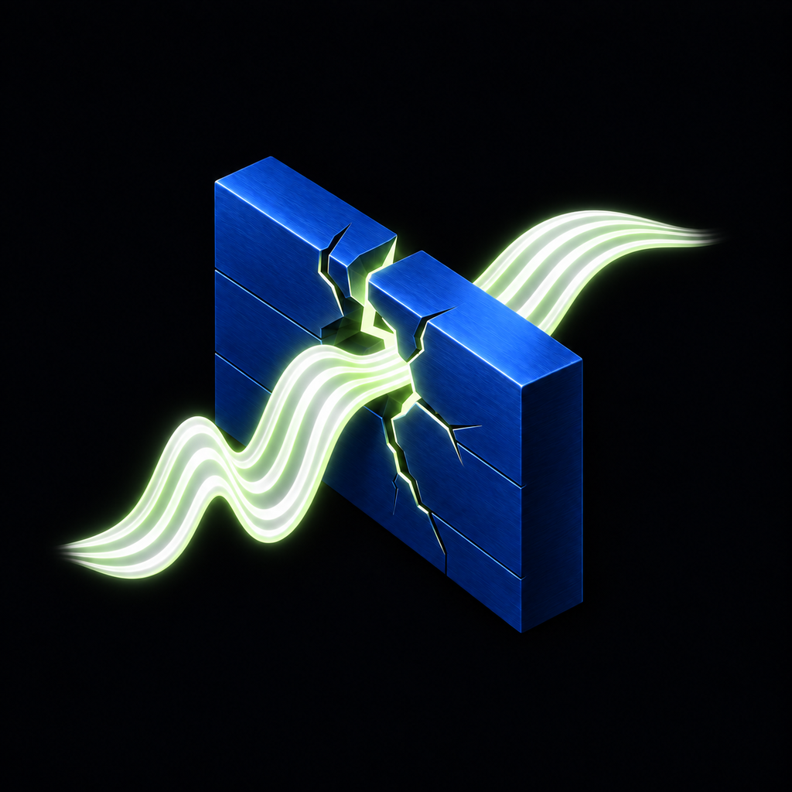

  
  <h1>olcOS</h1>
  
iOS 17+ · SwiftUI · WebRTC · VPN / SOCKS5

  
<strong>1.0 (1)</strong> · <code>v1.0.1</code>

   
  <h2><a href="README.ru.md">Русский</a> &nbsp; / &nbsp; <a href="README.en.md">English</a></h2>
  
Ваш iPhone. Ваш сервер. Ваше подключение.

  
Your iPhone. Your server. Your connection.

---

| [Русский →](README.ru.md) | [English →](README.en.md) |
|---|---|
| Возможности, настройка, сборка, архитектура и ограничения. | Features, setup, build instructions, architecture and limitations. |
