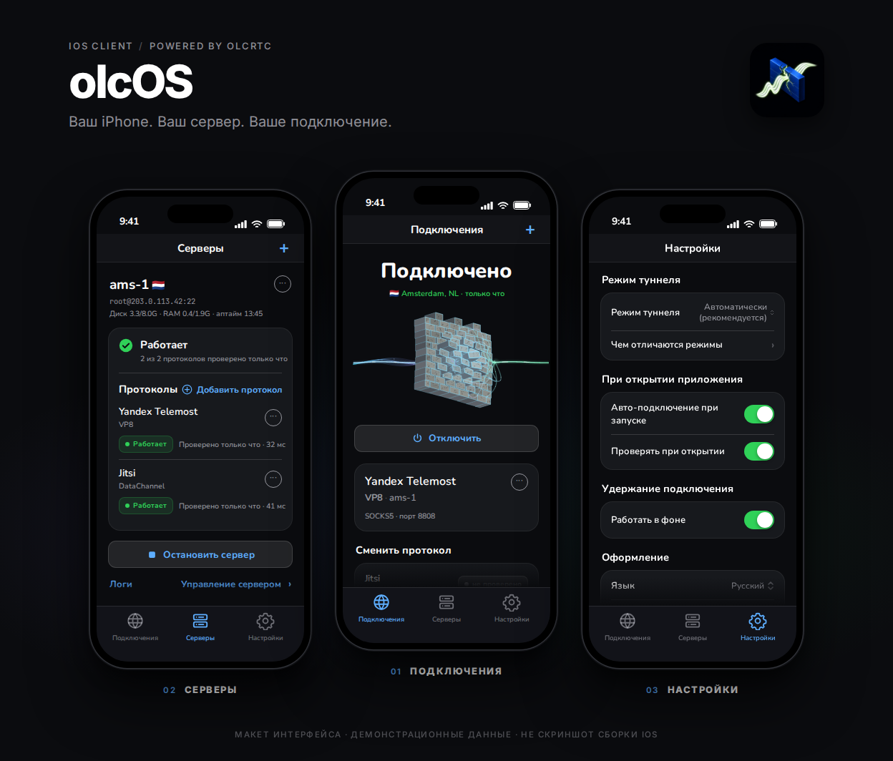
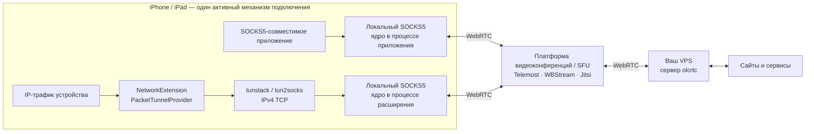
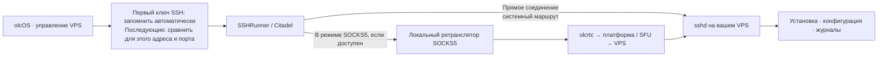

<div align="center">
  <p><strong>Русский</strong> · <a href="README.en.md">English</a></p>
  
  <h1>olcOS</h1>
  <p><strong>Ваш iPhone. Ваш сервер. Ваше подключение.</strong></p>
  <p>iOS 17+ · SwiftUI · Русский / Английский / Французский</p>
  <p><strong>2.0</strong> · сборка <strong>2</strong> · тег выпуска <code>v2.0.2</code></p>
  <p>
    <a href="#быстрый-старт">Начать</a> ·
    <a href="docs/build.md">Собрать</a> ·
    <a href="docs/architecture.md">Архитектура</a> ·
    <a href="SECURITY.md">Безопасность</a>
  </p>
</div>

**olcOS — iOS-клиент для подключения через собственный VPS на базе [olcrtc](https://github.com/openlibrecommunity/olcrtc), ядра передачи трафика через WebRTC и инфраструктуру видеоконференций.** Если вы ищете olcrtc для iPhone или изучаете обход блокировок через WebRTC, здесь собраны приложение, инструкции по сборке и честные границы его возможностей.

<div align="center">
  
  <p><sub>Концептуальное превью интерфейса — иллюстрация по текущим экранам и строкам приложения, не нативный скриншот и не подтверждение запуска в Xcode.</sub></p>
</div>

> **Область поддержки:** iPhone и iPad с iOS/iPadOS 17+; доступность VPN определяется установленной подписью, правами NetworkExtension и разрешением iOS, а не одним лишь типом Apple ID. [Конфигурация проекта](project.yml) · [проверка VPN](App/Core/VPNController.swift).
>
> Android, Windows и macOS — планы, не выпущенные и не поддерживаемые клиенты olcOS. Работа в любой сети, невидимость для оператора и неуязвимость к блокировкам не гарантируются.

## Что внутри

| Возможность | Что это означает |
|---|---|
| **Автоматический режим / VPN / SOCKS5** | Автоматический режим сначала выбирает VPN и допускает переход к SOCKS5 только при подтверждённой недоступности разрешения или возможности VPN; ошибки сети, ключа и платформы видеоконференций не являются поводом для такого перехода. [Логика режимов](App/Core/TunnelManager.swift). |
| **Собственный VPS** | Установка и управление сервером по SSH, импорт подключения по URI или QR, подписки на списки серверов. [Управление](App/Core/SSHRunner.swift) · [форматы ссылок](docs/uri.md). |
| **Платформы WebRTC** | В коде предусмотрены Telemost, WBStream и Jitsi; наличие варианта в интерфейсе не доказывает его доступность в вашей сети сегодня. [Матрица вариантов](App/Utilities/CarrierTransportMatrix.swift). |
| **Проверяемое состояние** | Проверки соединения, IP, скорости и журнал помогают разбирать сбои; успешная отдельная проба не гарантирует работу всех приложений. [Диагностика](docs/diagnostic-messages.md). |
| **Спокойный интерфейс** | Русский, английский и французский; тактильный отклик на действия; картинка с лучом и каменной firewall-стеной непрерывно движется только пока идёт подключение или соединение активно, экран виден и приложение на переднем плане; в покое и при ошибке проигрывается короткая конечная анимация, затем кадр статичен; при включённом уменьшении движения кадр всегда статичен. Плотность и темп следуют измеренной пропускной способности туннеля, но числа не печатаются: это **не график трафика и не измерение скорости**. [Локализация](App/Localization/L10n.swift) · [политика анимации и тактильного отклика](App/Views/SignalWaveform.swift). |

## Как проходит трафик

SOCKS5 и VPN — два разных места запуска ядра, а не два последовательно включённых туннеля. [Движок подключения](App/Core/TunnelEngine.swift) · [провайдер пакетного туннеля](Tunnel/PacketTunnelProvider.swift).



SSH — отдельный канал управления, не обязательный промежуточный узел пользовательского трафика: он идёт напрямую или через доступный локальный ретранслятор SOCKS5; при активном VPN обычное SSH-соединение следует системной маршрутизации. **SSH может вернуться к прямому соединению**, но сохранённый ключ сервера проверяется на обоих путях. [Запуск SSH](App/Core/SSHRunner.swift) · [маршрутизация SSH](App/Core/SSHTransport.swift).



Подробнее: [архитектура и границы доверия](docs/architecture.md).

## Быстрый старт

1. **Установите доверенную сборку.** Проверяйте состав и примечания в [выпусках](https://github.com/Hotelk52339/olcos-ios/releases); если нужного файла нет, используйте [сборку из исходников](docs/build.md). Наличие тега само по себе не доказывает успешную сборку или тестирование.
2. **Добавьте подключение.** Импортируйте доверенный `olcrtc://` / QR / `olcrtc-sub://` либо подготовьте собственный Linux VPS и установите сервер из приложения. Ссылки подключения содержат секреты — не публикуйте их. [Настройка](docs/setup.md) · [форматы URI](docs/uri.md).
3. **Подключитесь к VPS по SSH.** Вводить отпечаток ключа вручную не нужно: olcOS автоматически запоминает первый ключ для адреса и порта сервера и сравнивает его при следующих подключениях. Это доверие при первом использовании (TOFU), а не независимая проверка первого сервера; начальное соединение должно быть доверенным. [Проверка ключа](App/Core/SSHHostKeyVerification.swift).
4. **Выберите режим и подключитесь.** Начните с автоматического режима, затем проверьте фактический режим в интерфейсе. В SOCKS5 через туннель идут только явно настроенные клиенты, не всё устройство. [Режимы](App/Models/TunnelMode.swift) · [настройка](docs/setup.md).

### Собрать на Mac

Нужны полный Xcode с подходящим iOS SDK, XcodeGen, GitHub CLI и Go версии из закреплённой версии исходного проекта olcrtc; проект и библиотека генерируются, а технические имена `olcrtc-ios` сохраняются. [Проект](project.yml) · [скрипт сборки](scripts/build-framework.sh).

```bash
gh repo clone Hotelk52339/olcos-ios -- --recurse-submodules
cd olcos-ios
./scripts/build-framework.sh
xcodegen generate --spec project.yml
open olcrtc-ios.xcodeproj
```

Выберите команду разработчика для подписи приложения и расширения, сохранив согласованные идентификаторы пакетов и права; **сборка без подписи не подтверждает работоспособность VPN на устройстве**. Команды тестирования, загрузка готовой библиотеки и упаковка IPA: [руководство по сборке](docs/build.md).

## Ограничения, которые важно знать

- **VPN не равен поддержке любого IP-трафика.** Текущий пакетный тракт передаёт IPv4 TCP; UDP DNS получает ответ с флагом усечения для повторной попытки по TCP, прочий UDP отбрасывается. IPv6 захватывается маршрутом и отбрасывается, а не пропускается напрямую. Приложения, которым необходимы UDP или IPv6, могут не работать. [Пакетный туннель](Tunnel/PacketTunnelProvider.swift) · [адаптер tunstack](gomobile/tunstack/tunstack.go).
- **В VPN нельзя `videochannel`.** Также системный DNS должен быть IPv4-адресом на порту 53; неверная конфигурация отклоняется до установки маршрутов. [Валидация](Tunnel/PacketTunnelProvider.swift) · [конфигурация VPN](App/Models/VPNConfig.swift).
- **Отказ без обходного маршрута — свойство отдельных проверок, не обещание постоянной блокировки утечек.** Изменившийся сохранённый SSH-ключ отклоняется, неподдерживаемые пакеты не выводятся напрямую внутри активного туннеля; это не гарантия отсутствия прямого трафика до старта, после остановки или при сбое VPN. [Границы безопасности](SECURITY.md).
- **Секреты требуют осторожности.** Постоянное хранилище ключей — Keychain, но VPN передаёт ключ комнаты и токен в системный профиль на время запуска и сессии и пытается очистить их после остановки; сбой сохранения может оставить их в профиле. [Контроллер VPN](App/Core/VPNController.swift).
- **Доступность зависит от сети и сторонней платформы видеоконференций.** Здесь нет обещаний скорости, гарантированного уровня обслуживания, анонимности или универсального обхода блокировок. Используйте приложение с учётом применимого законодательства и правил используемых сервисов.

## Если что-то не работает

| Симптом | Первый шаг |
|---|---|
| Автоматический режим выбрал SOCKS5 | Прочитайте причину недоступности VPN; проверьте подпись, права NetworkExtension и разрешение iOS. Не считайте подключение только через прокси защитой всего устройства. [Режимы](App/Core/TunnelManager.swift). |
| VPN подключён, но часть приложений не работает | Проверьте IPv4 TCP, системный DNS, платформу и транспорт, а также ограничения UDP/IPv6. [Настройка](docs/setup.md). |
| Ключ сервера SSH изменился | Подключение блокируется с предупреждением. Если смена сервера или ключа ожидаема, явно подтвердите сброс сохранённого доверия и подключитесь снова; ключ никогда не заменяется незаметно. [Безопасность](SECURITY.md). |
| Порт SOCKS5 занят | Освободите выбранный порт или измените его и настройки внешнего клиента; приложение не подбирает другой порт незаметно. [OLC-1026](docs/diagnostic-messages.md). |
| Не хватает `Mobile.xcframework` или не проходит проверка соответствия скриптов | Инициализируйте подмодуль и выполните инструкции, не отключая проверку. [Сборка](docs/build.md). |

Для обычной ошибки: [отчёт с диагностикой](https://github.com/Hotelk52339/olcos-ios/issues/new/choose). Для уязвимости: **только [приватное сообщение](SECURITY.md)**. В публичный отчёт не нужны реальные IP, ключи, пароли, токены, приватные идентификаторы комнат или полные ссылки.

## Участие и лицензии

[Правила участия](CONTRIBUTING.md) — изменения и проверка; [технический контракт](AGENTS.md) — основные ограничения для разработки; [документация](docs/README.md) — полный указатель. Подробные технические руководства доступны на английском языке.

olcOS распространяется под [MIT](LICENSE), Copyright (c) 2026 Hotelk52339. Ядро olcrtc распространяется отдельно под [WTFPL](olcrtc-upstream/LICENSE).
