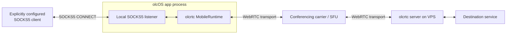
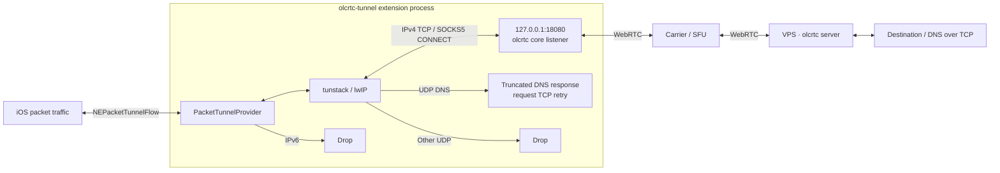
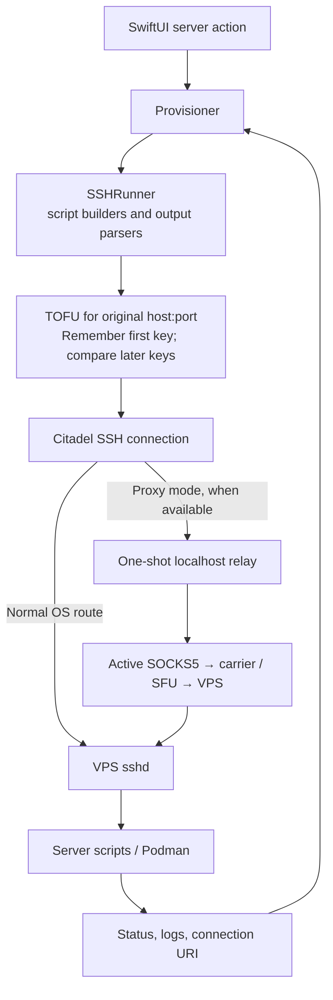

# olcOS architecture

[Overview](../README.md) · [Build](build.md) · [Security](../SECURITY.md)

This page describes implementation boundaries, not field-test results.
The product is **olcOS**; `olcrtc` remains the upstream protocol/core name and
part of compatible internal identifiers. The upstream implementation is
[openlibrecommunity/olcrtc](https://github.com/openlibrecommunity/olcrtc).

## Components

| Component | Responsibility |
|---|---|
| [`App/`](../App) | SwiftUI composition, connection/server stores, mode selection, SSH administration, diagnostics and localization |
| [`App/Core/TunnelEngine.swift`](../App/Core/TunnelEngine.swift) | Engine abstraction and in-app olcrtc runtime used by proxy mode |
| [`App/Core/TunnelManager.swift`](../App/Core/TunnelManager.swift) | Connection attempts, cancellation, backend ownership, reconnect and diagnostic-route state |
| [`App/Core/VPNController.swift`](../App/Core/VPNController.swift) | System profile lifecycle and observed NE status |
| [`Tunnel/`](../Tunnel) | Separate NetworkExtension process, its own core instance and packet pump |
| [`gomobile/tunstack/`](../gomobile/tunstack) | IP-to-SOCKS adapter using Outline SDK's lwIP/transport facilities |
| [`olcrtc-upstream/`](../olcrtc-upstream) | Pinned Go core and upstream installer, consumed during build/parity checks |
| [`scripts/`](../scripts) | Framework build/shims, server operations, packaging and local checks |

`App/Mobile.xcframework` combines upstream mobile and local tunstack in one
gomobile bind. The app and extension each link the framework; they do not
communicate by sharing a single in-app Go runtime.
[Framework build](../scripts/build-framework.sh) · [target dependencies](../project.yml).

## Data plane: proxy mode

The app selects the configured port exactly; in-app diagnostic clients use the
live bound endpoint and credentials rather than assuming that a changed
preference already changed a running listener. Proxy readiness alone is not
an end-to-end success: connection verification first checks the listener and
then HTTPS probes through SOCKS.
[TunnelManager](../App/Core/TunnelManager.swift) · [SOCKSSession](../App/Services/SOCKSSession.swift).

Only explicitly configured traffic uses this path. This mode is not a
device-wide VPN, and the app's background audio keeper is separate from
NetworkExtension lifecycle. [BackgroundRuntimeKeeper](../App/Services/BackgroundRuntimeKeeper.swift).

## Data plane: VPN mode

The provider installs IPv4 and IPv6 default routes, passes only IPv4 packets
to tunstack and drops IPv6. The SOCKS core supports TCP CONNECT; the packet
adapter uses DNS truncation rather than general UDP forwarding.
The extension's default loopback port is `18080`.
[Provider](../Tunnel/PacketTunnelProvider.swift) · [tunstack](../gomobile/tunstack/tunstack.go) ·
[VPNConfig](../App/Models/VPNConfig.swift).

Provider-originated carrier/resolver sockets use the underlying interface;
the code intentionally does not enable `includeAllNetworks` or add
destination-IP exclusions. This avoids looping the carrier path, but does
not constitute an always-on, all-traffic kill switch.
[Network settings](../Tunnel/PacketTunnelProvider.swift).

The extension uses a no-auth, loopback-only SOCKS listener; loopback is **not**
process-private on iOS. The provider rejects `videochannel` and tunes Go
memory/buffer use for the extension's constrained process budget.
These are code constraints, not measured memory or throughput guarantees.
[Provider initialization](../Tunnel/PacketTunnelProvider.swift).

The core resolver is used from the phone, while the OS DNS resolver's TCP
requests exit through the VPS. `VPNConfig` distinguishes them, maps known
carrier-internal resolver presets for system use, and rejects unsupported
system DNS before routes are installed.
[Resolver policy](../App/Models/VPNConfig.swift).

## Control plane: VPS administration

The relay completes the SOCKS handshake before Citadel begins SSH
authentication. Both direct and relay paths use endpoint-bound TOFU: the
first server key is remembered automatically, then later keys are compared
against that saved trust. The endpoint is the original VPS host and port,
never the relay's ephemeral localhost address. Transport retries can fall
back directly; a changed host key is terminal and must not become a route retry.
[SSHTransport](../App/Core/SSHTransport.swift) · [SSHRunner](../App/Core/SSHRunner.swift) ·
[host-key validator](../App/Core/SSHHostKeyVerification.swift).

A changed key requires an explicit, confirmed trust reset before a later
connection may establish new trust; the validator must never silently replace
it. TOFU checks continuity after first use, not independently verified identity
on the initial connection.
[Trust policy](../App/Core/SSHHostKeyVerification.swift) ·
[reset interface](../App/Views/AddServerHostView.swift).

First-use trust is saved before key validation succeeds. Trust is associated
with the canonical host and port rather than a host-record UUID, so recreating
a saved host does not clear it. Trust-store read/write failures stop the
connection instead of accepting a key that cannot be remembered.
[SSH trust implementation](../App/Core/SSHHostKeyVerification.swift).

Installation uploads/runs bundled scripts and parses their outputs; ordinary
user traffic does not need an SSH session per request. `srv.sh` uses persistent
deploy directories under `/opt`, Podman containers and the upstream server.
Reinstallation can replace earlier containers/deploy directories.
[Provisioning](../App/Core/Provisioning.swift) · [installer](../scripts/srv.sh).

Adding another carrier uses a sibling configuration/container sharing a deploy
directory, binary and key; key rotation and recovery must preserve the related
script/output contracts. The optional server bot is administration, not the
data-plane tunnel itself.
[Add-carrier script](../scripts/add-carrier.sh) · [key rotation](../scripts/rotate-key.sh) ·
[bot](../scripts/olcrtc-bot.py).

## Mode and lifecycle ownership

`ConnectionModePreference` stores Automatic/VPN/proxy intent separately from
`TunnelMode` and the actual session backend. Automatic begins VPN-first;
only typed NE permission/capability evidence permits downgrade, and stop plus
profile-secret cleanup must complete before proxy fallback. Unsupported
transport, DNS, carrier or key errors do not authorize it.
[Mode model](../App/Models/TunnelMode.swift) · [TunnelManager](../App/Core/TunnelManager.swift).

`MainTabView` owns and passes the app stores explicitly. `TunnelManager` keeps
connection operations guarded by attempt epochs, cancellation and active
backend, so a delayed completion cannot revive a disconnected attempt.
The observed active connection is not necessarily the user's newly selected
primary record. [Composition root](../App/App.swift) · [state machine](../App/Core/TunnelManager.swift).

In VPN mode, OS status is authoritative. The controller serializes profile
operations, observes status, saves then reloads before starting, and can adopt
an existing system tunnel. Proxy keepalive/reconnect/background effects must
not run against the extension as though it were the app's own engine.
[VPNController](../App/Core/VPNController.swift) · [profile boundary](../App/Core/VPNProfile.swift).

## Persistence and trust

Connection metadata and secret storage are separated; key, SOCKS password and
provider token are omitted from ordinary connection encoding and rehydrated
from Keychain. Loading/recovery must preserve unreadable bytes rather than
overwrite a damaged store with a new empty list.
[OlcrtcConnection](../App/Models/OlcrtcConnection.swift) · [ConnectionStore](../App/Core/ConnectionStore.swift).

There is no shared-Keychain/App-Group handoff to the provider. Full VPN startup
configuration temporarily persists the room key/token in system preferences;
terminal cleanup blanks those fields with a serialized save. Failed or
interrupted cleanup can leave persisted secrets, and a cleaned profile cannot
start cold from iOS Settings without app hydration.
[VPNConfig](../App/Models/VPNConfig.swift) · [VPNController](../App/Core/VPNController.swift) ·
[provider guard](../Tunnel/PacketTunnelProvider.swift).

The app, iOS, local clients, carrier/SFU, DNS resolver, VPS and destinations are
separate trust boundaries. A successful local listener, decorative waveform or
one diagnostic probe is not a claim of anonymity or universal connectivity.
For practical limitations and private disclosure, see [SECURITY.md](../SECURITY.md).

## Keep these contracts aligned

- XcodeGen sources/resources, generated bindings, the shared `VPNConfig` codec,
  extension compilation flag, bundle identifier relationship and entitlements.
  [Project](../project.yml) · [build](../scripts/build-framework.sh).
- Runtime setting setters in both engine and provider; support restrictions
  must agree at app validation and provider startup.
  [Engine](../App/Core/TunnelEngine.swift) · [provider](../Tunnel/PacketTunnelProvider.swift).
- SSH environment names, shell argument validation, script output parsing and
  parity/adaptation markers. [SSHRunner](../App/Core/SSHRunner.swift) ·
  [parity tests](../Tests/ServerScriptParityTests.swift).
- Carrier expectations versus actual observed probes; a source matrix is not
  live service status. [Matrix](../App/Utilities/CarrierTransportMatrix.swift) ·
  [HealthCoordinator](../App/Services/HealthCoordinator.swift).
- Diagnostic code cases versus the [catalog](diagnostic-messages.md);
  RU/EN/FR strings and extension resources; motion and haptics as interaction,
  not invented telemetry. [OlcCode](../App/Services/OlcCode.swift) ·
  [localization](../App/Localization/L10n.swift) · [motion policy](../App/Views/SignalWaveform.swift).
